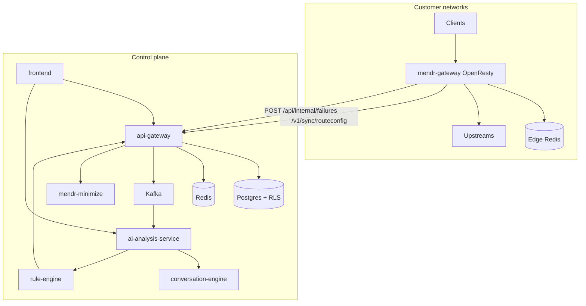

# Mendr Control Plane

Cloud / on-prem control plane for Mendr: service registry, snapshot sync, failure
ingestion, LLM-assisted diagnosis under a hard admission gate, conformal safety,
rule deploy, and the operator dashboard.

The edge lives in **`mendr-data-plane`**. Proxy traffic does not traverse this
plane except as a **Java fallback**.

## Services

| Service | Port | Role |
|---------|------|------|
| `api-gateway` | 8095 | Registry, snapshots, sync, failure ingest, Java proxy, portal/GitOps APIs |
| `ai-analysis-service` | 8082 | Failure analysis, LLM admission, safety gate, conformal, learning stack |
| `conversation-engine` | 8085 | Chat / `/diagnose` MendrScript authoring over MCP |
| `rule-engine` | 8084 | Approved-rule storage, disable, precedent commit |
| `notification-service` | 8083 | Operator notifications |
| `mendr-minimize` | 8099 | Rust sidecar: shrink transform programs (EqSat / egg) |
| `frontend` | 3000 | Dashboard |
| Postgres (pgvector), Redis, Kafka | — | Source of truth, cache/pubsub, async pipeline |

---

## Core philosophy

1. **Deterministic over probabilistic** — LLMs propose hypotheses; output is
   constrained into closed-opcode MendrScript, minimized, verified, and gated.
   The edge never runs raw model text.
2. **Observe at the edge, decide here, enforce from a local snapshot** — analysis
   is async (Kafka); the data plane keeps serving on LKG Redis snapshots if this
   plane or Redis is degraded.
3. **Gate the model, not Kafka** — over-budget / coalesced work is **acked and
   deferred** (metric + log), never nack/retried into an LLM storm.

---

## Topology



---

## Self-healing lifecycle (current)

1. **Detect** — edge sees 4xx/5xx (or splice abort after flush → category `SPLICE`).
2. **Edge telemetry** — `log.lua` dedups (`source:target:endpoint_template:category`),
   redacts PII, POSTs `IngestFailureRequest` (optional `suppressedCount`).
3. **Ingest** — `FailureIngestionService` Redis `SET NX` on
   `mendr:fail-dedup:{source}:{target}:{endpoint}:{category}` (tenant-scoped),
   persists, publishes `api.failures`.
4. **Admit LLM** — `LlmAdmissionControl`:
   - enrich + assemble `ErrorSignature`
   - coalesce key
     `mendr:analyze-coalesce:{tenant}:{templateId}:{category}:{changeType}:{jsonPath}`
   - in-process semaphore (default 2) **only around** LLM / diagnose
   - global/tenant budget counted **only on full admit**
   - defer → `null` result, Kafka ack, `mendr_analysis_deferred_total`
5. **Diagnose** — context + topology RCA + precedents + LLM tools (optional
   conversation-engine `/diagnose`).
6. **Safety gate** — conformal / Venn-Abers / refuse-auto-heal → `PENDING_APPROVAL`
   or `APPROVED`. Auto-apply defaults **off**.
7. **Minimize** — `mendr-minimize` shrinks the program when enabled.
8. **Deploy** — rule-engine / gateway materializes into the next
   `RouteConfigSnapshot`; edge lazy-syncs on `last_version` mismatch.

Kafka hygiene (`ai-analysis-service`): listener `concurrency=1`,
`max.poll.records=5`, `max.poll.interval.ms=600000`. Defer and unexpected
errors are not rethrown into retry storms.

---

## Snapshots & capabilities

`RouteConfigSnapshotPublisher` builds Lua-safe JSON snapshots (programs +
gateway policy overlays), capability-strips fields the edge did not advertise,
and serves `GET /v1/sync/routeconfig?since=&caps=` (long-poll ~30s → 304 or payload).

Capability tokens: `v2`, `ingress`, `traffic`, `ratelimit`, `authz`, `cache`,
`metrics`, `ai`, `waf`, `splice`.

- No `v2` → DSL-only (`ops[]`) routes withheld (not silently no-op’d).
- No `splice` → `planClass` stripped, `streamable=false` (DOM on the edge).

`PlanClassClassifier` ranks programs:
`PASSTHROUGH` < `PREFILTERABLE` < `FORWARD_ONLY` < `BOUNDED_WINDOW` < `UNBOUNDED`
— the edge picks splice vs DOM from that rank.

---

## API surface (api-gateway)

- `/api/services` — register service, contracts, OpenAPI import, manifests
- `/api/services/{name}/instances` — upstream pool
- `/api/gateway/rate-limit-policies`, `/api/gateway/ai-routes`
- `/api/gateway/gitops/manifest` — push `mendr.yaml`
- `/api/portal/*` — catalog, specs, self-service keys, usage
- `/api/internal/failures`, `/api/internal/otlp/v1/traces`
- `/api/gateway/proxy` — Java fallback for cold/degraded edges
- `/v1/sync/routeconfig`

Service registration may include optional `allowedCallerOrigins`; CORS is synced
into snapshots and enforced on the edge (no per-request control-plane call).

---

## Multi-tenancy & auth

Isolation is Postgres **FORCE RLS** as `app_user` (superusers bypass RLS — do not
run the app as superuser).

- `TenantContext` + `SET app.current_tenant` on connection borrow
- Humans: WorkOS JWT (`org_id` → tenant). `MENDR_AUTH_ENFORCE` defaults **false**
- Machines/edges: `X-Api-Key` `<prefix>.<secret>` (hashed); sync scoped to that tenant
- Kafka: `tenant_id` header; Redis keys namespaced `t:{tenantId}:`

See **[docs/MULTI_TENANCY.md](docs/MULTI_TENANCY.md)** for the full design.

Service-dependency graph + abstaining RCA:
**[docs/SERVICE_TOPOLOGY_RCA.md](docs/SERVICE_TOPOLOGY_RCA.md)**.

---

## Run

```powershell
docker compose up -d --build
```

### Required environment

- `LLM_PROVIDER` — `anthropic` (default) or `gemini` (same value for
  `ai-analysis-service` and `conversation-engine`)
  - Anthropic: `ANTHROPIC_API_KEY`, optional `ANTHROPIC_MODEL`
  - Gemini: `GEMINI_API_KEY`, optional `GEMINI_MODEL`
- `GATEWAY_INTERNAL_API_KEY` — shared internal key across gateway, analysis,
  conversation-engine

### LLM admission (ai-analysis-service)

```yaml
mendr.analysis.llm:
  semaphore: 2
  coalesce-ttl-seconds: 30
  global-per-minute: 30
  tenant-per-minute: 10
```

Env overrides: `MENDR_ANALYSIS_LLM_SEMAPHORE`, `MENDR_ANALYSIS_LLM_COALESCE_TTL`,
`MENDR_ANALYSIS_LLM_GLOBAL_PER_MIN`, `MENDR_ANALYSIS_LLM_TENANT_PER_MIN`.

Unit + Testcontainers Redis IT:
`LlmAdmissionControlTest`, `LlmAdmissionControlRedisIT` (skips without Docker).

### Remediation minimization

```
MENDR_MINIMIZE_ENABLED=true
MENDR_MINIMIZE_BASE_URL=http://mendr-minimize:8099
```

See `mendr-minimize/README.md`.

---

## Postgres migrations (existing volumes)

Compose mounts init scripts in numeric order on **new** volumes only (container-side
names use zero-padded `init_v02`–`init_v09` so lexical sort matches v2→v17). If a
first boot failed partway through init, reset with `docker compose down -v` before
retrying. For existing volumes that already initialized successfully, apply manually
(idempotent), for example:

```powershell
docker compose exec -T postgres psql -U admin -d selfhealing < infra/init_v3_analysis_conversations.sql
docker compose exec -T postgres psql -U admin -d selfhealing < infra/init_error_signature.sql
docker compose exec -T postgres psql -U admin -d selfhealing < infra/init_v5_error_precedents.sql
docker compose exec -T postgres psql -U admin -d selfhealing < infra/init_v7_self_learning.sql
# … through init_v15_minimization_pairs.sql as needed
```

Compose uses **`pgvector/pgvector:pg15`**. Volumes created on non-pgvector images
must be recreated for the vector extension.

### Notable init modules

| Script area | Contents |
|-------------|----------|
| Multitenancy | tenants, RLS, `app_user`, api_keys |
| ErrorSignature / precedents | pgvector, GraphRAG-style precedents |
| Self-learning | ACE, heuristics, LILO skills, MetaMemory, EvolveMem, GEPA, cross-tenant (opt-in) |
| Topology | SCD2 dependency graph (`init_v14`) |
| Minimization | preference pairs for shrinker |

Cross-tenant pool defaults **OFF** (`MENDR_CROSS_TENANT_ENABLED`); requires
explicit privacy attestation on opt-in.

---

## Ports

| Port | Service |
|------|---------|
| 3000 | Dashboard |
| 8095 | api-gateway |
| 8082 | ai-analysis-service |
| 8083 | notification-service |
| 8084 | rule-engine |
| 8085 | conversation-engine |
| 8099 | mendr-minimize |

---

## Mental model

1. Register services/contracts (or push a manifest).
2. Control plane compiles programs + policy into a **capability-gated snapshot**.
3. Edge long-polls, stores snapshots in **local Redis**, proxies **locally**.
4. On failures (and splice aborts), edge reports with template + category dedup.
5. Analysis proposes MendrScript under admission control; safety gate decides
   auto-deploy vs HITL.
6. Next sync, the edge lazy-reloads and runs the new program on splice or DOM.

That loop — **observe at the edge, decide in the control plane, enforce from a
local snapshot** — is the current design of Mendr.
