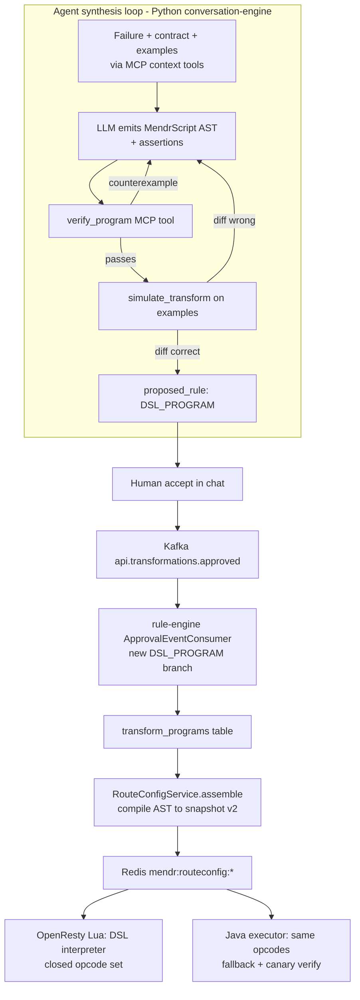

# MendrScript: Dynamically Synthesized, Verified Transform Rules

> Design plan for moving Mendr from a fixed rule-type catalog to dynamically
> synthesized, verified transform programs ("MendrScript"). Saved for later review.

## Overview

Replace the fixed rule-type catalog with a verified, dynamically-synthesized
transform DSL ("MendrScript"): a closed opcode set the LLM/agent composes into
novel per-incident programs, proven safe by a verifier and example-simulator,
compiled to the existing Redis snapshot for a hand-written Lua interpreter (no
LLM-authored Lua on the hot path), reusing the `api.transformations.approved`
deploy path. Plus a governed opcode-discovery loop and an isolated, off-hot-path
sandboxed Lua shadow lab for learning genuinely new primitives.

## Why

Today every "rule type" compiles into a fixed six-bucket struct
(`TransformProgram.java`) that the OpenResty/Lua edge interprets as a fixed data
shape. Adding a new capability needs Java + Lua + DB enum + an
`ApprovalEventConsumer` branch. We make the agent emit a verified DSL program
instead. We do NOT generate raw Lua for the hot path: LuaJIT FFI is RCE-prone
(2026 advisories) and the Lua author (Mike Pall) states VM-level sandboxing is
unsafe. Instead we follow the 2026 "language-is-the-sandbox" (safescript) +
"verified codegen" (VeriGuard) patterns.

## Architecture (3 tiers, all in scope)

- Tier 1 - Verified MendrScript DSL: closed opcode set, statically analyzable,
  compiles to BOTH the Lua snapshot and a Java executor.
- Tier 2 - Governed opcode discovery: agent proposes new opcode specs;
  eval-tested; human-promoted into the registry (the only place new exec code is
  written, reviewed once).
- Tier 3 - Sandboxed Lua shadow lab: off-hot-path, process-isolated, FFI-off,
  canary-only; used to learn candidate primitives, never to serve live traffic.

## Data flow (synthesis to deploy)

## DSL opcode set (initial, "lift + compositional")

Lift existing: `rename`, `default`, `coerce`, `remove`, `wrap`, `unwrap`.

Add compositional (no new capability, just instructions): `copy`, `move`,
`conditional` (predicate grammar: `eq/exists/in/regex-match`), `string`
(concat/split/lower/upper/trim/format), restricted `path` get/set (no
wildcard/recursion -> stays a DAG + streamable-classifiable), `lookup`
(value-map table), `arith` (+ - * / on numeric fields). Each op declares
fields-read / fields-written (its signature).

## Components and file touch-points

### Shared DSL model + compiler (api-gateway)

- New `transform/dsl/` package: `MendrProgram` (ordered `List<Op>` AST), `Op`
  sealed hierarchy, `Predicate`, `ProgramSignature` (reads/writes/opcodes/bounds).
- `MendrScriptCompiler`: AST -> `TransformProgramSnapshot v2`. Extend
  `TransformProgramSnapshot`
  (`mendr-control-plane/api-gateway/src/main/java/com/selfhealing/gateway/dto/RouteConfigSnapshot.java`)
  and the DTO in `RouteConfigSnapshotPublisher.toProgramSnapshot`
  (`mendr-control-plane/api-gateway/src/main/java/com/selfhealing/gateway/service/RouteConfigSnapshotPublisher.java`)
  with an `ops[]` array. Legacy edges keep reading the six buckets; upgraded
  edges read `ops[]`. Reuse `streamable` collision logic to classify fast/slow
  path.
- `MendrScriptExecutor`: Java interpreter over `ops[]` (dispatch table), used for
  the slow/streaming path and offline canary verification; mirror semantics of
  the Lua interpreter exactly.
- Wire into `RouteConfigService.assemble()`
  (`mendr-control-plane/api-gateway/src/main/java/com/selfhealing/gateway/service/RouteConfigService.java`)
  so a `DSL_PROGRAM` rule compiles into the snapshot.

### Verifier + simulator (ai-analysis-service)

- `MendrScriptVerifier` (extends the idea in `RuleValidator.java`,
  `mendr-control-plane/ai-analysis-service/src/main/java/com/selfhealing/analysis/service/RuleValidator.java`):
  pure `verify(program, contract, sourceSchema, targetSchema)`; checks opcode
  allowlist, arg types, op-count bound (halts by construction), reads/writes only
  manifest-declared fields, output validates against target `inferred_schema`
  (reuse `JsonSchemaInferrer`,
  `mendr-control-plane/api-gateway/src/main/java/com/selfhealing/gateway/util/JsonSchemaInferrer.java`).
  Returns ok or a counterexample.
- `TransformSimulator`: run `MendrScriptExecutor` over manifest
  `examples`/recorded payloads, diff against expected; returns per-example diffs.

### MCP tools for the agent loop

- Add `verify_program` and `simulate_transform` to `McpController`
  (`mendr-control-plane/ai-analysis-service/src/main/java/com/selfhealing/analysis/controller/McpController.java`)
  / `ContextToolExecutor`, alongside existing `get_contract` /
  `get_service_topology`. These power the VeriGuard-style counterexample refine
  loop.

### Python conversation-engine (synth loop)

- New LangGraph nodes in the planned Python engine: `propose_program` (LLM emits
  AST + assertions) -> `verify_program` -> `simulate_transform` -> loop on
  counterexample -> emit `proposed_rule` of type `DSL_PROGRAM` only when verified
  AND simulated-correct.

### Storage + deploy (reuse existing path)

- `infra/init.sql`: new `transform_programs` table (AST, signature, verification
  result, example-diffs, provenance: conversation_id, model,
  `supersedes_analysis_id`). Or store AST inside `proposed_rules.rule_definition`.
- Introduce ONE new `rule_type = DSL_PROGRAM` whose `rule_definition` IS the AST.
- Add `case "DSL_PROGRAM" -> deployDslProgram(...)` to `ApprovalEventConsumer`
  (`mendr-control-plane/rule-engine/src/main/java/com/selfhealing/rules/kafka/ApprovalEventConsumer.java`)
  (today unknown types hit the `default` branch). Reuses
  `api.transformations.approved` end-to-end - no new deployment pipeline.

### Lua edge interpreter (mendr-data-plane repo - NOT checked out locally)

- Hand-written, audited interpreter over the closed opcode set: `while` over
  `ops[]` with a `local handlers = {...}` dispatch. LLM output is DATA the
  interpreter walks - never code nginx loads. FFI stays disabled. Java
  `MendrScriptExecutor` must match byte-for-byte semantics. Requires cloning
  `ashcode64/mendr-data-plane`.

### Tier 2 - opcode discovery + governance

- `opcode_registry` (DB or config) as the single source of allowed opcodes for
  verifier, Lua interpreter, Java executor. Agent can emit an `OpcodeProposal`
  (name, signature, semantics, examples); offline eval-tested; human-promoted
  (the one place a new Lua handler + Java handler get written and reviewed).
  Agent expands vocabulary over time; never ships raw code.

### Tier 3 - sandboxed Lua shadow lab (off hot path)

- Separate sidecar process (NOT nginx worker): FFI off, `debug.sethook`
  instruction cap, `os/io/require/load` removed, seccomp/AppArmor. Runs
  LLM-generated Lua only as shadow/canary against recorded traffic to mine
  candidate opcodes for Tier 2. Never serves live requests.

### Eval + observability

- Extend the regression harness (`AnalysisRegressionHarnessTest`,
  `mendr-control-plane/ai-analysis-service/src/test/java/com/selfhealing/analysis/service/AnalysisRegressionHarnessTest.java`)
  with a DSL corpus: failure -> expected MendrProgram -> simulated output. Add
  tracing/metrics for synth-loop turns, verify pass/fail, canary diffs; audit AST
  + signature + proof on deploy.

## Sequencing

Tier 1 first (DSL model -> compiler -> snapshot v2 -> Java executor ->
verifier/simulator -> MCP tools -> Lua interpreter -> deploy branch -> eval).
Then Tier 2 (registry + discovery). Then Tier 3 (shadow lab). This keeps the
system shippable after Tier 1.

## Todos

- [ ] **dsl-model**: Create transform/dsl package in api-gateway: MendrProgram
  AST, Op sealed hierarchy (lift 6 ops + copy/move/conditional/string/path/lookup/arith),
  Predicate grammar, ProgramSignature (reads/writes/opcodes/bounds), shared JSON schema.
- [ ] **snapshot-v2**: Extend TransformProgramSnapshot +
  RouteConfigSnapshotPublisher.toProgramSnapshot with an ops[] array (snapshot
  v2); keep legacy six-bucket fields for backward compat; classify streamability.
- [ ] **compiler-executor**: Implement MendrScriptCompiler (AST -> snapshot v2)
  and MendrScriptExecutor (Java interpreter over ops[]) with dispatch table; wire
  into RouteConfigService.assemble for DSL_PROGRAM rules.
- [ ] **verifier-simulator**: Build MendrScriptVerifier (opcode allowlist, arg
  types, op-count bound, field-scope, target inferred_schema validation,
  counterexample output) and TransformSimulator (run over manifest examples, diff
  vs expected).
- [ ] **mcp-tools**: Add verify_program and simulate_transform tools to
  McpController/ContextToolExecutor for the agent refine loop.
- [ ] **py-synth-loop**: Add LangGraph nodes to the Python conversation-engine:
  propose_program -> verify_program -> simulate_transform -> counterexample refine
  loop -> emit DSL_PROGRAM proposed_rule only when verified + simulated-correct.
- [ ] **storage-deploy**: Add transform_programs table (AST, signature,
  verification, diffs, provenance) to infra/init.sql; introduce rule_type
  DSL_PROGRAM; add deployDslProgram branch in ApprovalEventConsumer reusing
  api.transformations.approved.
- [ ] **lua-interpreter**: In mendr-data-plane repo (clone required):
  hand-written audited Lua interpreter over the closed opcode set (handlers
  dispatch table, FFI off); ensure semantics match Java MendrScriptExecutor exactly.
- [ ] **opcode-registry**: Tier 2: opcode_registry as single source of allowed
  opcodes (verifier/Lua/Java); OpcodeProposal flow; offline eval; human promotion
  writing the one reviewed Lua+Java handler per new primitive.
- [ ] **lua-shadow-lab**: Tier 3: process-isolated sidecar (FFI off,
  debug.sethook instruction cap, os/io/require/load removed, seccomp/AppArmor)
  running LLM-generated Lua as shadow/canary against recorded traffic to mine
  candidate opcodes; never serves live requests.
- [ ] **eval-observability**: Extend regression harness with a DSL corpus; add
  synth-loop tracing/metrics (turns, verify pass/fail, canary diffs) and audit of
  AST+signature+proof on deploy.

## References (2026 external grounding)

- safescript ("the language is the sandbox"): static DAG, closed instruction set,
  not Turing-complete, resource bounds knowable before running.
- VeriGuard ("verified codegen"): LLM emits code + spec, automated verifier
  proves it, counterexample refine loop, runtime monitor.
- LuaJIT FFI arbitrary code execution advisory (March 2026); OpenResty docs: FFI
  "not safe for use by untrusted Lua code"; Mike Pall: sandbox Lua at the process
  level, not the VM level.
